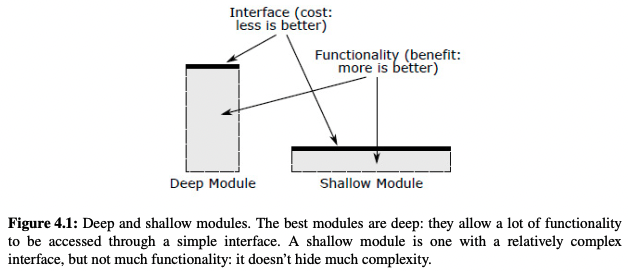

# Philosophy of Software Design

This document is a summary of the book Philosophy of Software Design.

## 1. It's All About Complexity

The greatest limitation in writing software is our ability to understand the systems we are creating. As a program evolves, complexity inevitably increases and the system becomes harder to understand, slowing down development and leading to bugs.
There are two general approaches to fighting complexity:
- Making code simpler and more obvious. For example, eliminating special cases or using identifiers in a consistent fashion.
- Encapsulate complexity, so that programmers can work on a system without being exposed to all of its complexity at once. This approach is called **modular design**, as the software system is divided up into modules designed to be relatively independent of each other.

## 2. The Nature of Complexity

_Complexity is anything related to the structure of a software system that
makes it hard to understand and modify the system_, if a software system is
hard to understand and modify, then it is complicated, otherwise is simple. In
a complex system, it takes a lot of work to implement small improvements. In a
simple one, larger improvements can be implemented with less effort. Isolating
complexity in a place where it will never be seen is almost as good as
eliminating the complexity entirely. If you write a piece of code and it seems
simple to you, but other people think it's complex, then it is complex. A
developers job is not just to create code that you can work easily, but to
create code that others can also work with easily.

Complexity manifests itself in three general ways:
- Change amplification: Simple change requires code modifications in many
  different places.
- Cognitive Load: A high cognitive load means that the developer needs to spend
  a lot of time learning the required information and there is a greater risk
  of bugs because they missed something important. **Sometimes an approach that
  requires more lines of code is actually simpler, because it reduces cognitive
  load**
- Unknown Unknowns: It's not clear which pieces of code must be modified to
  complete a task or what information a developer must have to carry out the
  task successfully. This is the worst symptom of complexity.

Complexity is caused by two things: _dependencies_ and _obscurity_. A
dependency exists when a piece of code cannot be understood and modified
without understand another piece of code. The idea is to reduce dependency and
make it as simple and obvious as possible. Obscurity occurs when information is
not obvious. Obscurity is often associated with dependency and inconsistency.
The need for extensive documentation is often a sign that the design isn't
quite right. Complexity is incremental, it comes from an accumulation of
dependencies and obscurities.

## 3. Working code isn't enough
Be a strategical programmer instead of a tactical programmer. 

This is what being each other means:
- **Strategical programmers**: they won't accept to introduce unnecessary complexities to finish their tasks faster. The most important thing to them is the long-term structure of the system. They'll take a little extra time to find simpler designs for every implementation and to solve any design problem they find (they have an investment mindset).
- **Tactical programmers**: their main focus is to get something working without spending too much time thinking about the design.

If you implement a tactical programming approach, instead of continually making small improvements to the system design (strategical programming) you will be adding complexity. You should have an investment mindset.

## 4. Modules Should be Deep

Modular design attempts to minimize the dependencies between the modules that conform a system, trying to keep them as independent as possible from each other.

We think of each module in two parts:
  - Interface: it abstracts the module, describing _what_ it does.
  - Implementation: the code that carries out what the interface states.

An abstraction is a simplified view of an entity, which omits unimportant details. In modular programming, each module provides an abstraction in the form of its interface. Separating the interface of a module from its implementation helps to hide the complexity of the implementation from the rest of the system.

We could also classify modules into two categories:
  - Deep modules: they provide powerful functionalities hidden behind simple interfaces. It's a good abstraction because only a small fraction of its internal complexity is visible to its users.
  - Shallow modules: a relatively complex interface in comparison to the functionality that it provides. They give a small benefit in comparison to the cost of learning and using their interfaces.

